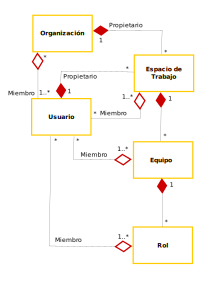

# Modelo de Autorización de Acceso a Recursos 
### Resource Access Authorization Model [RAAM]

El RAAM es un conjunto de conceptos y convenciones para implementar políticas de seguridad a través de un sistema de gestión de usuarios desacoplado.

## Conceptos
* Organización. Es la representación de una empresa o institución, un ente jurídico que posee recursos accedidos por usuarios.
* Usuario. Es la representación de quien hace uso de los recursos de una organización, un empleado, socio, colaborador, voluntario, etc.
* Espacio de trabajo. Es una estructura con un propósito funcional formada por equipos y usuarios.
* Equipo. Es una subestructura funcional de un espacio de trabajo a la cual pueden pertenecer usuarios.
* Rol. Representa un papel (rol) asignado a usuarios dentro de un equipo. 



* Operación. Es una acción atómica sobre un recurso.
* Privilegio. Es el derecho a realizar una operación sobre un recurso.
* Manifiesto de privilegios. Es el conjunto de privilegios asignados a usuarios, roles, equipos o espacios de trabajo de un recurso.
* Membresía. Es la relación (pertenencia) de un usuario a un rol, equipo o espacio de trabajo.
* Recurso. Es la representación de un objeto de valor para la organización (archivo, servicio,  proceso, etc.).


## Estructuras de datos

### Manifiesto de privilegios
```
{
	"Privilegio":[{ "tipo_asignacion": "identificador"}, ...],
	...
}
```
Donde:
* Privilegio. Es una cadena que identifica (o nombra) un privilegio.
* tipo_asignación. Es alguna de las cadenas: "user", "role", "team", "workspace" o bien, el nombre de una propiedad esperada en la información de la sesión de usuario.
* identificador. Es el identificador del tipo de objeto indicado en el tipo de la asignación.

### Información de sesión de usuario

```
{
	"ids":"Identificador (token) de sesión",
	"uid":"Identificador de usuario",
	"name":"Nombre del usuario",
	
	"propiedad1":"valor propiedad 1",
	...,
	
	"memberships":
	{
		"workspaces":["id_workspace1",...],
		"teams":["id_team1",...],
		"roles":["id_role1",...]
	}
	...
}
```

## Componentes


La solicitud de realización de una operación es recibida por la Interfaz del sistema [System Interface] que recaba información del usuario  a través del Proveedor de Identificaciones (Id Provider) y el manifiesto de privilegios por parte del Directorio de recursos [Resource Directory] que son enviados al Controlador de Autorizaciones [Authorization Controller] que determinará si se realiza la solicitud o se deniega.

* System Interface. Permite la interacción del sistema con el exterior, ya sea una interfaz de usuario (Web o escritorio), servicios Web, etc.
* Id Provider. Valida la identidad del usuario (a través del par de credenciales usuario y contraseña o bien un identificador 'token' de sesión) y proporciona toda la información de la estructura Información de la sesión de usuario.
* Resource Directory. Proporciona la información en la estructura de datos del manifiesto de privilegios de un recurso identificable unívocamente.
* Authorization Controller. Comprueba si la solicitud de operación requiere privilegios y si el usuario los posee para autorizar o denegar su realización.

### Controlador de Autorizaciones
La lógica interna del Controlador de Autorizaciones es dependiente del sistema y está fuertemente acoplada al mismo, sin embargo se espera funcione concediendo la autorización a un usuario para efectuar una determinada operación sobre un recurso si:

* El usuario está específicamente asignado al privilegio correspondiente o,
* El usuario tiene una membresía a un objeto de tipo de asignación explícitamente asociado al privilegio o,
* El usuario tiene una propiedad que coincide con un tipo de asignación explícitamente asociado al privilegio o
* Se ha definido lógica específica 


